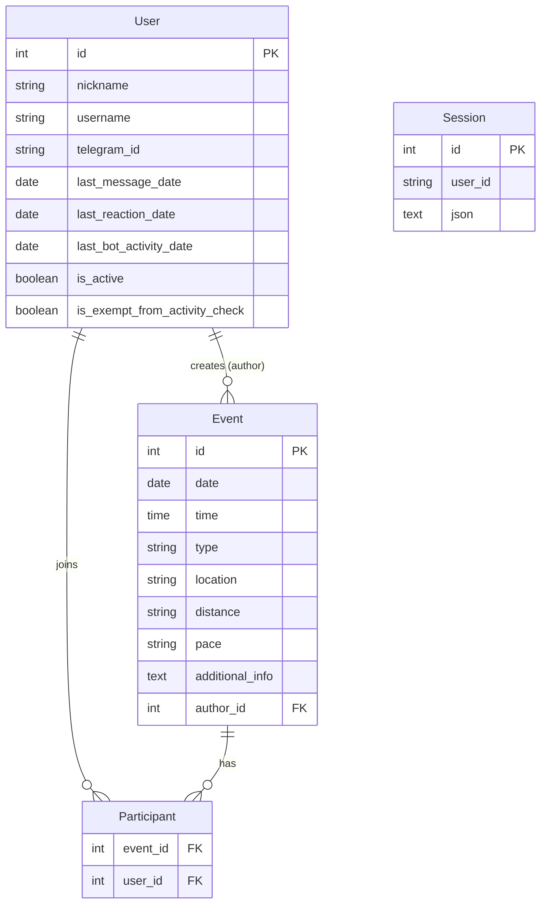

# sport-event-bot

A Telegram bot for organizing sports events in community groups. Members can create events, discover and join upcoming activities, and manage their participation — all through a conversational bot interface in Russian.

## Features

- **Event creation** — interactive wizard with inline calendar date picker, time, type, location, distance/pace, and additional info
- **Event discovery** — find events for today, tomorrow, the week, or browse all upcoming events on a calendar
- **Participation management** — join/leave events with one tap; get notified when someone joins your event or when event details change
- **Event editing** — update start time, location, or description after creation
- **Channel publishing** — publish events to a public Telegram channel individually or as a daily digest
- **Activity monitoring** — cron-based script that scans group message history and marks members as active or inactive
- **Admin tools** — view inactive users, exempt members from activity checks, trigger daily announcement publishing

## Tech Stack

| Layer | Technology |
|---|---|
| Bot framework | [Telegraf](https://telegraf.js.org/) v4 |
| Web server | Express |
| ORM | Sequelize v6 |
| Database (dev) | SQLite |
| Database (prod) | MySQL with SSL |
| Telegram API client | [GramJS](https://github.com/gram-js/gramjs) (`telegram` package) |
| Templating | Mustache |
| Date/time | Day.js + Luxon |
| Env management | @dotenvx/dotenvx |

## Prerequisites

- Node.js 18+
- npm
- For production: a MySQL database and a publicly reachable HTTPS domain for the Telegram webhook

## Installation

```bash
git clone https://github.com/tulaman/sport-event-bot.git
cd sport-event-bot
npm install
```

## Configuration

Configuration is split across files in `config/`:

| File | Purpose |
|---|---|
| `config/default.json` | Shared defaults (event types, button labels, activity window) |
| `config/development.json` | Dev overrides (SQLite, 7-day activity window) |
| `config/production.json` | Prod overrides (MySQL connection, webhook domain, channel ID) |
| `config/messages.yml` | All bot message strings (in Russian) |
| `config/ca-certificate.crt` | CA certificate for MySQL SSL in production |

## Environment Variables

Create a `.env` file in the project root:

```env
# Required — Telegram bot token from @BotFather
TG_TOKEN=your_bot_token

# Required in production — database password
DB_PASSWORD=your_db_password

# Optional — comma-separated Telegram user IDs with admin access
# (defaults to config value)

# Activity monitoring (required only if using activity_monitor.js)
TG_API_ID=your_api_id          # from https://my.telegram.org/apps
TG_API_HASH=your_api_hash
TG_STRING_SESSION=your_session  # generated with telegram_login.js
TG_TARGET_CHAT=your_group_id   # numeric group/supergroup ID
ACTIVITY_WINDOW_DAYS=30        # optional, overrides config value
```

## Development

```bash
# Start bot with auto-restart on file changes (SQLite database)
npm run dev
```

The development environment uses SQLite and auto-syncs the database schema on startup (`sequelize.sync({ alter: true })`).

## Production

```bash
# Run migrations first
npm run db:migrate

# Start the bot
npm start
```

In production the bot runs as a webhook on an Express server. It also exposes a `GET /publish-today-events` endpoint that can be called by a cron job to post the daily event digest to the public channel.

**Example cron for daily digest** (every day at 09:00):
```bash
0 9 * * * curl -s https://your-domain.com/publish-today-events
```

## Database Migrations

```bash
npm run db:migrate          # run pending migrations
npm run db:migrate:undo     # revert the last migration
npm run db:migrate:status   # check migration status
```

## Bot Commands

### User Commands

| Command | Description |
|---|---|
| `/start` | Register and get welcome message |
| `/help` | Show welcome message |
| `/create` | Create a new event (interactive wizard) |
| `/find` | Browse events (today / tomorrow / this week / all) |
| `/my_events` | View and manage your created or joined events |

### Admin Commands

| Command | Description |
|---|---|
| `/announcement` | Publish today's events to the public channel |
| `/inactive` | List users marked as inactive |
| `/exempt <username\|id> [...]` | Exempt one or more users from activity checks |
| `/unexempt <username\|id> [...]` | Remove exemption from one or more users |
| `/exempt_list` | List all exempted users |

Admin access is controlled by the `admin_ids` array in the production config.

## Activity Monitoring

The activity monitoring system tracks member engagement in the Telegram group and marks users as active or inactive.

**Tracked signals (any one counts as active):**
- Sent a message in the group
- Added a reaction in the group
- Created or joined an event via the bot

**Activity window** — configurable in days (priority order):
1. `ACTIVITY_WINDOW_DAYS` environment variable
2. `activity_monitoring.window_days` in the environment config file (7 in dev, 30 in prod)
3. Default: 30 days

### Setup

**1. Install activity monitoring dependencies** (already included in `package.json`):
```bash
npm install
```

**2. Get Telegram API credentials** at [https://my.telegram.org/apps](https://my.telegram.org/apps).

**3. Generate a session string:**
```bash
node telegram_login.js
```
Follow the prompts, then save the printed session string to `TG_STRING_SESSION` in your `.env` file.

**4. Schedule the monitor** (e.g., weekly on Sunday at 03:00):
```bash
0 3 * * 0 cd /path/to/sport-event-bot && node activity_monitor.js >> /var/log/activity_monitor.log 2>&1
```

### How It Works

`activity_monitor.js` reads the group message history via the Telegram API (GramJS), updates `last_message_date` for each sender found within the activity window, then evaluates all three activity columns to set `is_active` on each User record. Exempt users (`is_exempt_from_activity_check = true`) are never marked inactive.

## Architecture

```
app.js              — bot entry point: command handlers, callback handlers, Express server
db.js               — Sequelize setup, model definitions (Event, User, Session)
utils.js            — date/time formatting helpers
activity_monitor.js — standalone cron script for group activity analysis
telegram_login.js   — one-time helper to generate a Telegram session string
config/
  index.js          — config loader (merges default + env-specific + messages.yml)
  default.json      — shared config (event types, button labels)
  development.json  — dev overrides
  production.json   — prod overrides (MySQL, webhook domain, channel ID)
  messages.yml      — all Russian message strings (Mustache templates)
migrations/         — Sequelize CLI migration files
docs/               — setup guides
```

### Database Models



## License

GPL-3.0-only © [Ilya Lityuga](https://github.com/tulaman)
